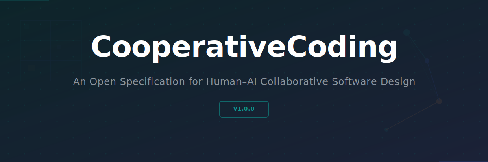
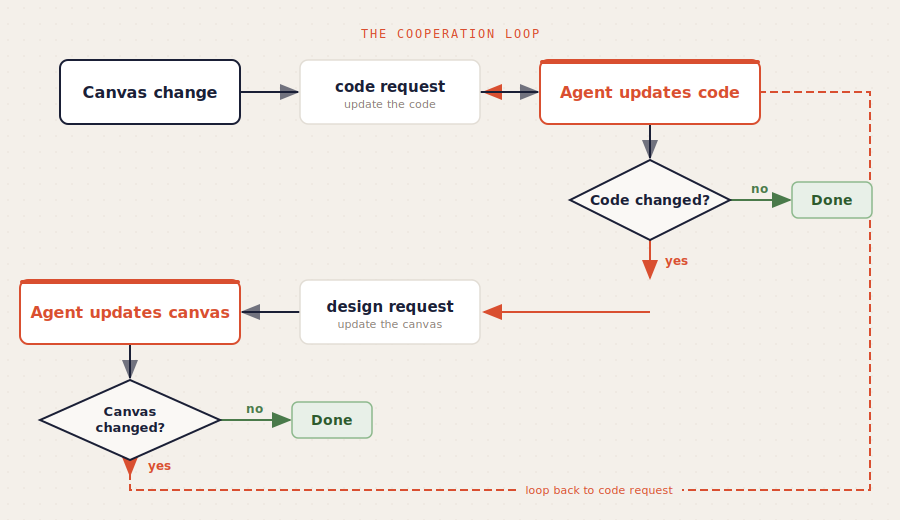
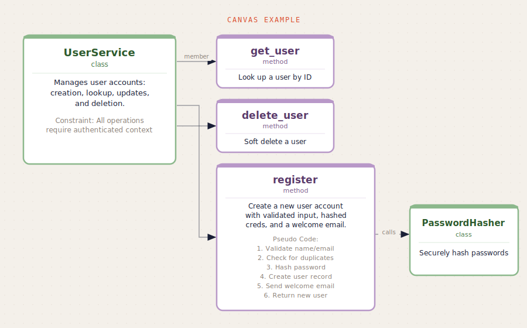
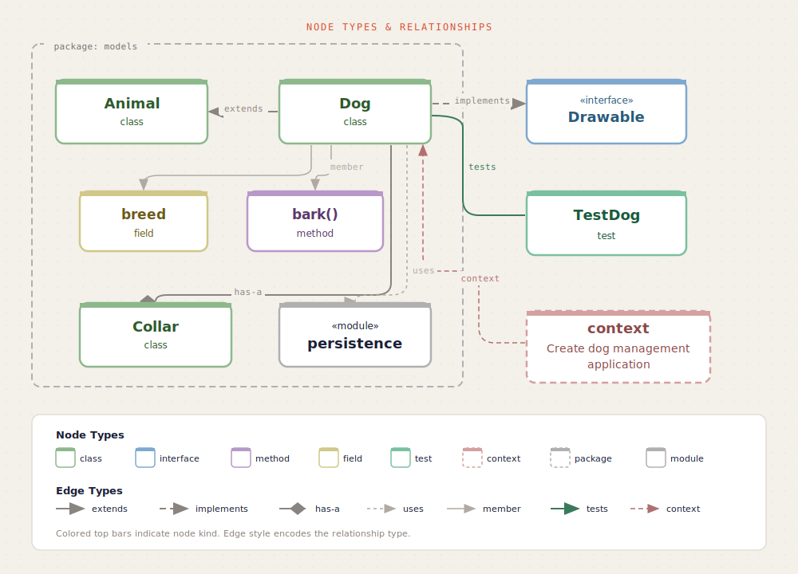

<p align="center">
  
</p>

> Current agentic coding treats software as text to be generated.
> CooperativeCoding treats it as architecture to be negotiated.

AI agents are remarkably good at implementing code that satisfies a given specification, but they are not yet capable of producing clean software designs. CooperativeCoding gives the human a visual canvas where architecture is defined in natural language, while the code stays in continuous bidirectional sync. Both the human and the agent can change either side, and every change is immediately visible.

## What is CooperativeCoding?

CooperativeCoding is an open specification for human-AI collaborative software design. It defines a design contract where architectural decisions live as first-class objects: code elements carry responsibility statements and pseudo code, relationships between elements are tracked for code generation, and a continuous sync loop keeps the canvas and code aligned. The human maintains authority by editing the canvas at any time.

The spec is language-agnostic, tool-agnostic, and format-agnostic. It can be implemented for any programming language (Python, TypeScript, Rust, ...), any canvas tool (Obsidian, VS Code, Excalidraw, ...), and any storage format (JSON, markdown, databases, ...).

## How It Works

<p align="center">
  
</p>

1. **Design** on a visual canvas: create architectural elements with responsibilities, pseudo code, and relationships.
2. **Sync** keeps canvas and code aligned. Canvas changes produce code requests (update the code). Code changes produce design requests (update the canvas).
3. **Loop** autonomously: implement, test, fix, repeat. Every change is visible on the canvas.
4. **Intervene** at any time by editing the canvas or the code. Version control provides audit, review, and rollback.

## Visual Example

> **Note:** The visuals below show one possible implementation using nodes and edges on a JSON Canvas. The spec does not prescribe this format &mdash; implementations are free to use any canvas tool, file format, and visualization approach.

### Canvas: A UserService with its methods

<p align="center">
  
</p>

### Generated Python code (from canvas)

```python
class UserService:
    """Manages user accounts: creation, lookup, updates, and deletion.

    Responsibility:
        All user lifecycle operations including registration,
        lookup, updates, and soft deletion.
    """

    def get_user(self, user_id: str) -> User:
        """Look up a user by ID."""
        raise NotImplementedError

    def delete_user(self, user_id: str) -> None:
        """Soft delete a user."""
        raise NotImplementedError

    def register(self, name: str, email: str, password: str) -> User:
        """Create a new user account with validated input, hashed creds, and a welcome email.

        Pseudo Code:
            1. Validate name and email format
            2. Check for duplicates in db
            3. Hash password using hasher
            4. Create user record in db
            5. Send welcome email
            6. Return new user
        """
        raise NotImplementedError
```

### The sync loop in action

1. Human creates the `UserService` class and `register` method on the canvas with pseudo code
2. Canvas change produces a **code request**. The Python code above is generated.
3. During implementation of `register()`, a `validate_email()` helper is needed
4. Code change produces a **design request**. A `validate_email` method appears on the canvas.
5. Human sees the new method on the canvas. The loop stabilizes.
6. Human edits the pseudo code on the canvas to add step "7. Provision default settings"
7. Canvas change produces a **code request**. The implementation is updated.

## Example Data Model

> **Note:** The diagram below shows one possible representation using typed nodes and edges. The spec does not prescribe specific element types, relationship types, or visualization approaches &mdash; these are defined by each implementation and its language binding.

<p align="center">
  
</p>

## The Specification

| Document | Description |
|---|---|
| [Introduction](spec/00-introduction.md) | Vision, principles, and terminology |
| [Design Contract](spec/01-design-contract.md) | Identity, responsibility, pseudo code, relationships, and source mapping |
| [Sync](spec/02-sync.md) | Sync loop, convergence, entry points, and roles |
| [Language Bindings](spec/03-language-bindings.md) | Contract for language-specific mappings |

## Language Bindings

| Language | Binding | Status |
|---|---|---|
| Python | [bindings/python.md](bindings/python.md) | Reference binding |

Want to add a binding for your language? See [CONTRIBUTING.md](CONTRIBUTING.md).

## Reference Implementation

The Python reference implementation is available at [cooperative-coding-python](https://github.com/giosullutrone/cooperative-coding-python).

## Contributing

CooperativeCoding is an open initiative. We welcome contributions to the spec, new language bindings, and implementations for new canvas tools. See [CONTRIBUTING.md](CONTRIBUTING.md).

## License

This specification is licensed under [CC-BY-4.0](https://creativecommons.org/licenses/by/4.0/).
